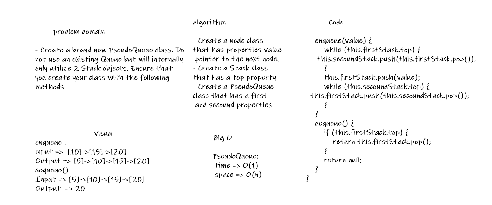

# queue With Stacks
<!-- Short summary or background information -->

## Challenge
<!-- Description of the challenge -->
* Create a brand new PseudoQueue class. Do not use an existing Queue. Instead, this PseudoQueue class will implement our standard queue interface (the two methods listed below), but will internally only utilize 2 Stack objects. Ensure that you create your class with the following methods:
## Approach & Efficiency
<!-- What approach did you take? Why? What is the Big O space/time for this approach? -->
* Write a function called PseudoQueue
## Solution
<!-- Embedded whiteboard image -->
